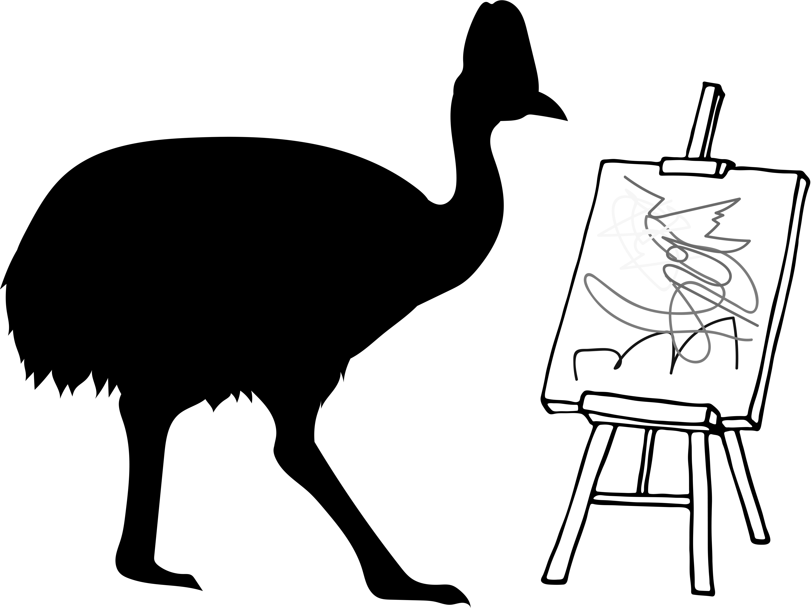

```{r setup, include=FALSE}
knitr::opts_chunk$set(echo = TRUE)  

# Set up notes

## Check logo size

```
## The Experiment

*Insert awesome text here*

## The Results 

*Insert compelling insights here*

  