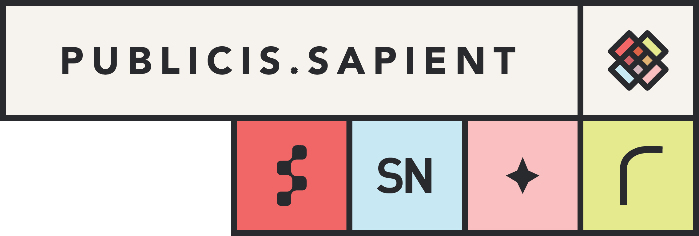

```{r setup, include=FALSE}
knitr::opts_chunk$set(echo = TRUE)  

```

## Summary



*Insert awesome text here*

## Detail 


*Insert compelling insights here*

## Further thoughts


*Insert keen questions and suggested next steps here*  

Need to get corporate colour palette and fonts to incorporate into this.   